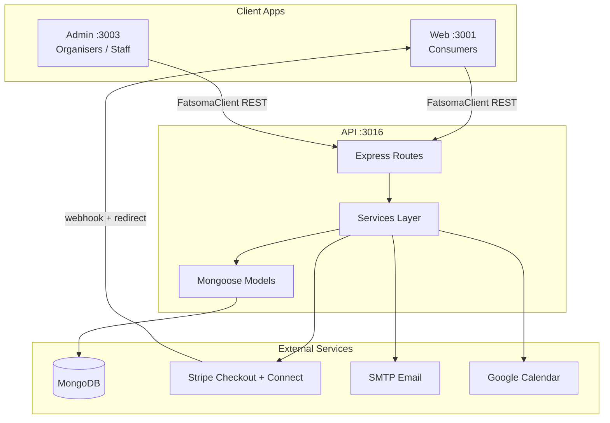

# OnTheList — Project Documentation

> **Product:** OnTheList is an event ticketing platform with primary sales, peer-to-peer resale, Stripe Connect payouts for organisers, and on-site QR scanning.  
> **Repo layout:** Three independent apps (not a monorepo). Package names still use the legacy `fatsoma-*` prefix.

---

## Table of Contents

1. [Repository Structure](#repository-structure)
2. [Tech Stack](#tech-stack)
3. [Getting Started](#getting-started)
4. [Architecture Overview](#architecture-overview)
5. [User Roles & Permissions](#user-roles--permissions)
6. [Data Models](#data-models)
7. [API Reference](#api-reference)
8. [Business Flows](#business-flows)
9. [Web App (Consumer)](#web-app-consumer)
10. [Admin App (Organiser Panel)](#admin-app-organiser-panel)
11. [Shared Contracts](#shared-contracts)
12. [Payments & Fees](#payments--fees)
13. [Environment Variables](#environment-variables)
14. [Deployment](#deployment)
15. [Known Gaps & Quirks](#known-gaps--quirks)

---

## Repository Structure

```
onthelist/
├── api/          # Express + MongoDB backend (port 3016)
├── web/          # Next.js public consumer app (port 3001)
├── admin/        # Next.js organiser/admin panel (port 3003)
├── ecosystem.config.js   # PM2 production config
├── start-all.sh          # Dev: start all three apps
├── start-all.bat
├── install-all.bat
├── build-all.bat
├── README.md
├── ARCHITECTURE.md
└── DOCUMENTATION.md        # This file
```

Each app has its own `package.json`, `node_modules`, and environment files. Shared types/schemas are **copied** into each app under `shared/` (or `lib/shared/`) — there is no shared npm package.

---

## Tech Stack

| Layer | Technology |
|-------|------------|
| **API** | Express 5, TypeScript, Mongoose (MongoDB), Zod validation |
| **Web** | Next.js 16 (App Router), React 19, Tailwind CSS 4 |
| **Admin** | Next.js 16 (App Router), React 19, Tailwind CSS 4, react-hook-form (installed, largely unused) |
| **Payments** | Stripe Checkout, Stripe Connect Express, webhooks |
| **Auth** | JWT (access 2h + refresh 7d), bcrypt passwords |
| **Email** | Nodemailer (SMTP) |
| **Calendar** | Google Calendar OAuth |
| **Uploads** | Multer → local `uploads/` directory |

---

## Getting Started

### Prerequisites

- Node.js 20+
- MongoDB instance
- Stripe account (test keys for development)
- SMTP server (optional for emails)
- Google OAuth credentials (optional for calendar)

### Install & Run

```bash
# Install dependencies in each app
cd api && npm install
cd ../web && npm install
cd ../admin && npm install

# Or use the batch script on Windows
./install-all.bat

# Start all three apps (from repo root)
./start-all.sh
# Or individually:
cd api && npm run dev      # http://localhost:3016
cd web && npm run dev      # http://localhost:3001
cd admin && npm run dev    # http://localhost:3003
```

### API Environment

The API loads env from `api/.env.development` or `api/.env.production` based on `NODE_ENV`. See [Environment Variables](#environment-variables).

### Seed Data

```bash
cd api && npm run seed
```

---

## Architecture Overview



### Request Flow

```
Client → CORS → Logger → Auth middleware (if required) → Route → Controller → Service → Model
                                                                                    ↓
                                                              Stripe / Email / Google APIs
```

### Fulfillment Paths

Ticket fulfillment after payment is **dual-path** (idempotent):

1. Client redirect → `POST /api/checkout/session/:sessionId/confirm`
2. Stripe webhook → `checkout.session.completed`

Both paths run the same fulfillment logic. Guards prevent duplicate ticket generation.

---

## User Roles & Permissions

| Role | Web App | Admin App | API Access |
|------|---------|-----------|------------|
| **user** | Buy tickets, resale, profile | Blocked (redirected to login) | Consumer endpoints |
| **organizer** | — | Dashboard, events, payments, staff | Own events only; Stripe Connect required to publish |
| **staff** | — | Scanner only | Scan at assigned event + gate |
| **admin** | — | Full panel incl. organiser management | All resources |

Staff accounts are scoped to a single `staffEventId` and `staffGateName`. Scan validation enforces these constraints automatically.

---

## Data Models

### User

| Field | Description |
|-------|-------------|
| `name`, `email`, `password` | Core identity (email unique) |
| `role` | `admin` \| `staff` \| `organizer` \| `user` |
| `isActive` | Soft disable |
| `stripeConnect.*` | Stripe Express account state |
| `googleCalendar.*` | OAuth tokens for calendar sync |
| `staffEventId`, `staffGateName` | Staff scanner assignment |
| `resetPasswordToken`, `resetPasswordExpires` | Password reset flow |

### Event

| Field | Description |
|-------|-------------|
| `eventName`, `eventDescription`, `eventCategory` | Event metadata |
| `eventImage`, `eventBanner` | Image URLs (uploaded via API) |
| Venue fields | `venueName`, `addressLine`, `city`, `postcode`, `country`, `mapsLink` |
| `eventDate`, `eventEndDate`, `startTime`, `endTime` | Schedule |
| `ticketGroups[]` | Nested: group → batches (slots) |
| `ticketBatches[]` | Legacy flat structure (migrated on save) |
| `totalTickets`, `dynamicPricing`, `bookingFee` | Commerce settings |
| `allowResale`, `platformCommission` | Resale config |
| `status` | `draft` \| `published` |
| `createdBy` | Ref to organiser User |

**Ticket group structure:**

```
ticketGroups[]
  └── title (e.g. "General Admission")
  └── sortOrder
  └── batches[]
        └── name, quantity, basePrice
        └── minDiscount, maxDiscount
        └── entryWindowCutoff (optional datetime)
```

### Ticket

| Field | Description |
|-------|-------------|
| `orderId`, `eventId`, `userId` | Ownership refs |
| `ticketBatchName` | Display tier name |
| `primaryInventoryBatchName` | Inventory tier consumed |
| `purchasePrice`, `originalPrice` | Pricing |
| `status` | `active` \| `listed` \| `transferred` \| `used` \| `cancelled` |
| `qrCode` | Unique UUID (auto-generated) |
| `usedAt` | Scan timestamp |

### Order

| Field | Description |
|-------|-------------|
| `eventId`, `userId` | Purchase refs |
| `type` | `primary` \| `resale` |
| `status` | `pending` \| `paid` \| `settlement_pending` \| `failed` \| `expired` \| `refunded` \| `partially_refunded` |
| `stripeSessionId`, `stripePaymentIntentId` | Stripe refs |
| `quantity`, `basePrice`, `capturedBookingFee`, `totalAmount` | Line item |
| `customerEmail`, `customerName` | Buyer info |
| `resaleListingId` | Set for resale orders |

### ResaleListing

| Field | Description |
|-------|-------------|
| `ticketId`, `eventId`, `sellerId`, `buyerId` | Parties |
| `askingPrice`, `originalPurchasePrice` | Pricing |
| `targetTicketBatchName` | Batch buyer receives |
| `reallocationType` | `same_batch` \| `upgraded_batch` \| `sold_out_reallocated` |
| `platformFee`, `sellerPayout`, `organiserRevenue` | Settlement breakdown |
| `status` | `active` \| `sold` \| `cancelled` \| `expired` |

### Notification

| Field | Description |
|-------|-------------|
| `userId`, `type`, `title`, `body` | Content |
| `metadata` | Context (order ID, event ID, etc.) |
| `dedupeKey` | Prevents duplicate notifications |
| `isRead`, `readAt` | Read state |

---

## API Reference

Base URL: `http://localhost:3016` (dev)

### Auth — `/api/auth`

| Method | Endpoint | Auth | Description |
|--------|----------|------|-------------|
| POST | `/register` | — | Create consumer account |
| POST | `/login` | — | Login (all roles) |
| POST | `/staff/login` | — | Staff-specific login |
| POST | `/refresh` | — | Refresh access token |
| POST | `/forgot-password` | — | Send reset email |
| POST | `/reset-password` | — | Set new password |
| GET | `/me` | ✓ | Current user profile |

### Events — `/api/events`

| Method | Endpoint | Auth | Description |
|--------|----------|------|-------------|
| GET | `/published` | — | Public event catalog |
| GET | `/` | Admin/Organizer | List events |
| GET | `/:id` | Admin/Organizer | Event detail |
| POST | `/` | Admin/Organizer | Create event |
| PUT | `/:id` | Admin/Organizer | Update event |
| PATCH | `/:id/status` | Admin/Organizer | Publish/unpublish |
| PATCH | `/:id/owner` | Admin | Assign organiser |
| DELETE | `/:id` | Admin/Organizer | Delete event |

### Checkout — `/api/checkout`

| Method | Endpoint | Auth | Description |
|--------|----------|------|-------------|
| POST | `/create-session` | ✓ | Create Stripe Checkout session |
| GET | `/session/:sessionId` | — | Get order by session |
| POST | `/session/:sessionId/confirm` | — | Fulfill after payment |
| POST | `/webhook` | — | Stripe webhook (raw body) |

### Tickets — `/api/tickets`

| Method | Endpoint | Auth | Description |
|--------|----------|------|-------------|
| GET | `/my` | ✓ | Buyer's tickets |
| GET | `/:id` | ✓ | Single ticket (owner) |
| POST | `/scan/validate` | Admin/Staff | QR scan validation |

### Resale — `/api/resale`

| Method | Endpoint | Auth | Description |
|--------|----------|------|-------------|
| POST | `/list` | ✓ | List ticket for resale |
| GET | `/my` | ✓ | Seller's listings |
| DELETE | `/:id` | ✓ | Cancel listing |
| GET | `/event/:eventId` | — | Active listings for event |
| POST | `/:id/buy` | ✓ | Buy resale ticket |

### Orders — `/api/orders`

| Method | Endpoint | Auth | Description |
|--------|----------|------|-------------|
| GET | `/my` | ✓ | Buyer's orders |
| GET | `/` | Admin/Organizer | All orders (filtered) |
| GET | `/stats` | Admin/Organizer | Revenue stats |

### Users — `/api/users`

| Method | Endpoint | Auth | Description |
|--------|----------|------|-------------|
| GET/POST/PATCH/DELETE | `/staff/*` | Admin/Organizer | Staff management |
| GET/POST/PATCH/DELETE | `/*` | Admin | Organiser/user management |

### Other Routes

| Mount | Purpose |
|-------|---------|
| `/api/uploads` | Image upload (auth required, 5 MB, images only) |
| `/api/calendar` | Google Calendar OAuth + add event |
| `/api/notifications` | In-app notifications |
| `/api/connect` | Stripe Connect onboarding |
| `/api/health` | Health check |
| `/uploads/*` | Static uploaded files |

---

## Business Flows

### 1. Event Creation & Publishing

```
Organiser creates event (draft)
  → Adds ticket groups/batches via admin UI
  → Saves as draft OR publishes

Publish gate:
  → Organiser must complete Stripe Connect onboarding
    (chargesEnabled + payoutsEnabled + detailsSubmitted)

Published events appear in GET /api/events/published
  → Enriched with remaining inventory + active resale counts per batch
```

### 2. Primary Ticket Purchase

```
Buyer selects batch + quantity on event page
  → Logged in? If not → redirect to /login
  → POST /api/checkout/create-session
      → Allocates active resale listings first (FIFO, excludes self)
      → Checks primary inventory for remainder
      → Creates Stripe Checkout with Connect destination + application fee
  → Redirect to Stripe hosted checkout
  → Return to /checkout/success?session_id=...
  → confirmCheckoutSession() OR webhook fulfills:
      → Create Order (status: paid)
      → Transfer any resale tickets in cart
      → Generate new tickets for primary quantity
      → Send confirmation email + notification
```

**Mixed cart:** A single checkout can include both resale listings and primary inventory tickets.

### 3. Resale Flow

```
Seller lists active ticket:
  → POST /api/resale/list { ticketId, askingPrice? }
  → Event must have allowResale: true
  → System computes target batch (same tier or upgrade within group)
  → Min asking price enforced (original price or target batch price)
  → Ticket status → listed

Buyer purchases resale:
  → Included in primary checkout OR direct POST /api/resale/:id/buy
  → On payment: completeResaleTransfer()
      → Refund seller at original purchase price
      → Transfer ticket ownership to buyer
      → No new tickets minted

Cancel listing:
  → DELETE /api/resale/:id
  → Ticket status → active
```

**Resale economics:**

| Party | Receives |
|-------|----------|
| Seller | Refund of original purchase price |
| Organiser | `askingPrice - originalPurchasePrice` |
| Platform | 7% booking fee (via Stripe application fee) |

### 4. On-Site Scanning

```
Staff/Admin scans QR code
  → POST /api/tickets/scan/validate { qrCode, eventId? }

QR formats:
  1. Bundle: bundle:v1:orderId:eventId:userId:encodedBatchName
     → Marks all active tickets in bundle as used
  2. Single: UUID qrCode
     → Marks one ticket as used

Validations:
  → Correct event (staff auto-scoped to assigned event)
  → Correct gate (staff auto-scoped to assigned gate)
  → Entry window not closed (entryWindowCutoff)
  → Ticket status is active (not used/cancelled/listed)
```

### 5. Stripe Connect (Organisers)

```
POST /api/connect/stripe/account        → Create/retrieve Express account
POST /api/connect/stripe/onboarding-link → Redirect to Stripe onboarding
GET  /api/connect/stripe/status          → Sync account state

Webhook account.updated → syncs chargesEnabled, payoutsEnabled, etc.
Required before event can be published.
```

### 6. Google Calendar

```
POST /api/calendar/google/connect-url  → OAuth redirect
GET  /api/calendar/google/callback     → Store tokens on user
POST /api/calendar/google/add-event    → Insert event into user's calendar
```

---

## Web App (Consumer)

**Port:** 3001  
**Package:** `fatsoma-web`

### Routes

| Route | Auth | Purpose |
|-------|------|---------|
| `/` | — | Landing page |
| `/events` | — | Event catalog (search, filter, calendar) |
| `/events/[id]` | — | Event detail + ticket purchase |
| `/tickets` | ✓ | My tickets, QR codes, resale |
| `/checkout/success` | — | Post-Stripe confirmation |
| `/login`, `/signup` | — | Authentication |
| `/forgot-password`, `/reset-password` | — | Password recovery |
| `/profile` | ✓ | Purchase/resale history |
| `/how-it-works`, `/pricing`, `/trust-safety`, `/help-centre`, `/contact`, `/terms` | — | Marketing/content pages |

### Key Components

| Component | Purpose |
|-----------|---------|
| `Header` | Nav, notifications bell, user menu |
| `ExploreEventCard` | Event grid card |
| `TicketPurchasePanel` | Batch selection, quantity, Stripe checkout (inline in event page) |
| `ResaleModelSection` | Resale explainer on home/how-it-works |

### Auth

- JWT stored in `localStorage` (`fatsoma_access_token`, `fatsoma_refresh_token`)
- `AuthProvider` context wraps the app
- `FatsomaClient` auto-refreshes on 401
- No Next.js middleware — pages gate client-side

### Env Vars

| Variable | Default |
|----------|---------|
| `NEXT_PUBLIC_API_URL` | `http://localhost:3016` |
| `NEXT_PUBLIC_ORGANISER_DASHBOARD_URL` | `http://localhost:3003/dashboard` |
| `NEXT_PUBLIC_APP_CURRENCY` | `GBP` |

---

## Admin App (Organiser Panel)

**Port:** 3003  
**Package:** `fatsoma-admin`

### Routes

| Route | Roles | Purpose |
|-------|-------|---------|
| `/login` | — | Sign in |
| `/dashboard` | Admin, Organizer | Metrics, Stripe Connect banner |
| `/events` | Admin, Organizer | Event list |
| `/events/create` | Admin, Organizer | Create event |
| `/events/[id]/edit` | Admin, Organizer | Edit/publish/delete |
| `/payments` | Admin, Organizer | Order history + stats |
| `/staff` | Admin, Organizer | Scanner account management |
| `/users` | Admin | Organiser management |
| `/scanner` | All | QR ticket validation |
| `/panel` | Admin (direct URL) | Platform fee overview |

### Key Components

| Component | Purpose |
|-----------|---------|
| `AuthenticatedLayout` | Auth gate + role-based route guards |
| `Sidebar` | Role-filtered navigation |
| `AddTicketTypeFlow` | Ticket group/batch editor with presets |
| `ticketPresetOptions` | GA, VIP, Queue Jump, Male/Female, Custom presets |

### Ticket Presets

| Preset | Creates |
|--------|---------|
| General Admission | Single "General Admission" slot |
| VIP | Single "VIP" slot |
| Queue Jump | Single "Queue Jump" slot |
| Male / Female | Two slots: "Male" + "Female" |
| Custom | User-defined group title + slots |

### Env Vars

| Variable | Default |
|----------|---------|
| `NEXT_PUBLIC_API_URL` | `http://localhost:3016` |

---

## Shared Contracts

Each app maintains a local copy of shared code:

| App | Path |
|-----|------|
| API | `api/src/shared/` |
| Web | `web/src/lib/shared/` |
| Admin | `admin/src/lib/shared/` |

### Files

| File | Contents |
|------|----------|
| `types.ts` | TypeScript interfaces (Event, User, Ticket, Order, Resale, etc.) |
| `schemas.ts` | Zod validation schemas (mirrored with API) |
| `constants.ts` | `BOOKING_FEE_PERCENT`, `RESALE_FEE_PERCENT`, enums |
| `index.ts` | Barrel exports |

### API Client

Both frontends use `FatsomaClient` (`lib/api-client/client.ts`):

- Factory: `createBrowserClient()` (web) / `createApiClient()` (admin)
- Auto token refresh on 401
- Full REST surface for all API endpoints

**Important:** Changes to types/schemas must be manually synced across all three apps.

---

## Payments & Fees

| Fee | Rate | Applied To |
|-----|------|------------|
| Booking fee | **7%** | Primary ticket purchases |
| Resale fee | **7%** | Resale transactions |

Constants defined in `shared/constants.ts` (`BOOKING_FEE_PERCENT`, `RESALE_FEE_PERCENT`).

### Stripe Connect Split

- Checkout uses `application_fee_amount` for platform fee
- `transfer_data.destination` routes remainder to organiser's Connect account
- Resale seller refunds issued against original `stripePaymentIntentId`

### Order Statuses

| Status | Meaning |
|--------|---------|
| `pending` | Checkout session created, not paid |
| `paid` | Successfully fulfilled |
| `settlement_pending` | Resale seller refund failed (retryable) |
| `failed` | Payment failed |
| `expired` | Checkout session expired |
| `refunded` / `partially_refunded` | Refund issued |

---

## Environment Variables

### API (`api/.env.development` / `api/.env.production`)

| Variable | Required | Default | Purpose |
|----------|----------|---------|---------|
| `MONGODB_URI` | **Yes** | — | MongoDB connection |
| `STRIPE_SECRET_KEY` | **Yes** | — | Stripe API |
| `STRIPE_WEBHOOK_SECRET` | For webhooks | `""` | Webhook signature |
| `JWT_SECRET` | No | dev default | Access tokens |
| `JWT_REFRESH_SECRET` | No | dev default | Refresh tokens |
| `PORT` | No | `3016` | Server port |
| `HOST` | No | `0.0.0.0` | Bind address |
| `CORS_ORIGIN` | No | `localhost:3001,3003` | Allowed origins |
| `WEB_URL` | No | `http://localhost:3001` | Checkout redirects, emails |
| `API_URL` | No | `http://localhost:3016` | OAuth callback base |
| `ADMIN_URL` | No | `http://localhost:3003` | Connect onboarding return |
| `SMTP_SERVER` | No | `localhost` | Email |
| `SMTP_PORT` | No | `587` | Email |
| `SMTP_USER` | No | — | Email auth |
| `SMTP_PASSWORD` | No | — | Email auth |
| `GOOGLE_CLIENT_ID` | For calendar | `""` | Google OAuth |
| `GOOGLE_CLIENT_SECRET` | For calendar | `""` | Google OAuth |
| `GOOGLE_OAUTH_REDIRECT_URI` | No | `{API_URL}/api/calendar/google/callback` | OAuth callback |
| `CALENDAR_STATE_SECRET` | No | falls back to JWT_SECRET | OAuth state HMAC |
| `LOG_DIR` | No | `{cwd}/logs` | Structured logs |

### Web & Admin

| Variable | Default | Purpose |
|----------|---------|---------|
| `NEXT_PUBLIC_API_URL` | `http://localhost:3016` | API base URL |
| `NEXT_PUBLIC_ORGANISER_DASHBOARD_URL` | `http://localhost:3003/dashboard` | Web link to admin |
| `NEXT_PUBLIC_APP_CURRENCY` | `GBP` | Display currency (web only) |

---

## Deployment

### PM2 (`ecosystem.config.js`)

| App | Production Port | Working Directory |
|-----|-----------------|-------------------|
| API | 3016 | `./api.onthelistapp.co.uk` |
| Web | 3017 | `./web` |
| Admin | 3018 | `./admin.onthelistapp.co.uk` |

```bash
# Build
cd api && npm run build
cd web && npm run build
cd admin && npm run build

# Start with PM2
pm2 start ecosystem.config.js
```

### Build Scripts

- `build-all.bat` — builds all three apps
- `install-all.bat` — installs dependencies in all apps

---

## Known Gaps & Quirks

### Dead / Unused Code

| Location | Issue |
|----------|-------|
| `web/src/components/ExploreHeader.tsx` | Defined but unused |
| `web/src/app/events/[id]/page.tsx` | `VenueCard`, `ResaleListingsSection` defined but not rendered |
| `admin/src/components/events/TicketTiersEditor.tsx` | Exported but unused (replaced by `AddTicketTypeFlow`) |
| `admin/src/app/panel/page.tsx` | Implemented but not in sidebar nav |
| `admin/package.json` | `react-hook-form` installed but unused |
| `web/package.json` | `zod` not listed; schemas imported but not used for validation |

### Incomplete Features

| Feature | Status |
|---------|--------|
| Gift ticket transfer | UI stub — "endpoint not available yet" |
| Direct resale buy UI | API exists; separate `ResaleListingsSection` not mounted |

### Debug Artifacts

- `web/src/app/tickets/page.tsx` contains debug `fetch` calls to `127.0.0.1:7700/ingest/...` (agent logging)

### Data Sync Notes

- Event list revenue in admin uses flattened `ticketBatches`; events with only `ticketGroups` may need API-side flattening for accurate display
- `bookingFee` on Event model defaults to 10% but is overridden to 7% constant on create
- Legacy `ticketBatches[]` migrated to `ticketGroups[]` on Event save

### Auth Storage

- Tokens in `localStorage` (not httpOnly cookies)
- No Next.js middleware for route protection — all gating is client-side

---

## Quick Reference

### Dev Ports

| Service | Port |
|---------|------|
| API | 3016 |
| Web | 3001 |
| Admin | 3003 |

### Production Ports (PM2)

| Service | Port |
|---------|------|
| API | 3016 |
| Web | 3017 |
| Admin | 3018 |

### Local Storage Keys

| Key | Purpose |
|-----|---------|
| `fatsoma_access_token` | JWT access token |
| `fatsoma_refresh_token` | JWT refresh token |

### Log Files (API)

| Path | Content |
|------|---------|
| `api/logs/api-access-YYYY-MM-DD.log` | Request access log |
| `api/logs/errors-YYYY-MM-DD.log` | Error log |

---

*Last updated: June 2026*
